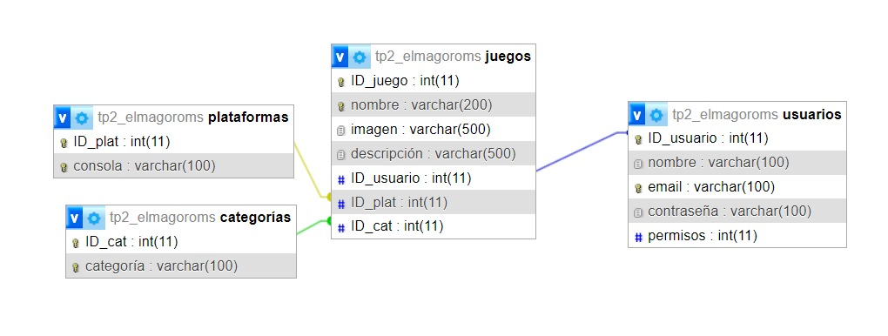

# web2_ElMaGoRoms
## Descripción
Este proyecto consiste en una página web donde los usuarios pueden descargar ROMs para jugar videojuegos de otras plataformas en su PC. La base de datos almacena información sobre los juegos, plataformas, categorías y usuarios que pueden publicar sus propios ROMs y que tienen permisos para modificar los datos.

## Modelo de Datos
La base de datos está compuesta por las siguientes entidades principales:

- **Juegos**: Almacena los videojuegos disponibles para descargar. Cada juego tiene un `id_juego`, `nombre`, `imagen`, y `descripción`.
- **Plataformas**: Almacena las plataformas (consolas o sistemas) en las que se pueden jugar los ROMs. Tiene un `id_plataforma` y un `nombre`.
- **Categorías**: Almacena las categorías o géneros a los que pertenecen los juegos (ej. Aventura, Deportes). Cada categoría tiene un `id_categoria` y un `nombre`.
- **Usuarios**: Almacena información sobre los usuarios que publican ROMs y que tienen acceso para modificar los datos de la base de datos, incluyendo un `id_usuario`, `nombre`, `email`, y `contraseña`.

### Relaciones entre las entidades:
- **Juegos y Plataformas**: Un juego puede estar disponible en varias plataformas, y una plataforma puede tener varios juegos. Esto implica una relación de muchos a muchos, lo que requiere una tabla intermedia `juego_plataforma` que almacena las claves foráneas de ambas tablas.
- **Juegos y Categorías**: Un juego puede pertenecer a una o más categorías, estableciendo una relación de muchos a muchos. Se usa una tabla intermedia `juego_categoria` para gestionar estas relaciones.
- **Usuarios y Permisos**: Los usuarios tienen acceso a modificar los datos de la base de datos, y sus roles están definidos en la tabla `usuarios`.

## Diagrama de la Base de Datos

## Autor
Este proyecto fue realizado por Matías Morcillo (matiasmorcillo128@gmail.com) y Iago Medina Durán (iagomduran@gmail.com).
